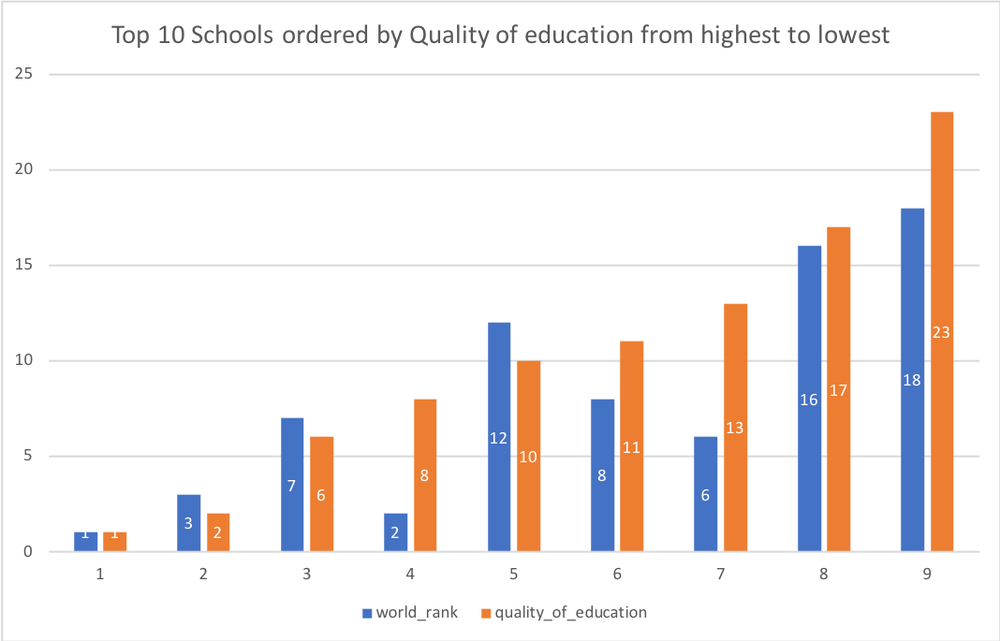
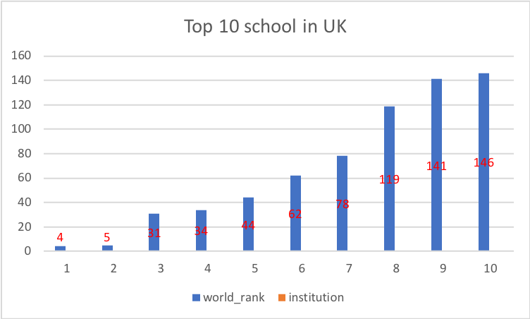
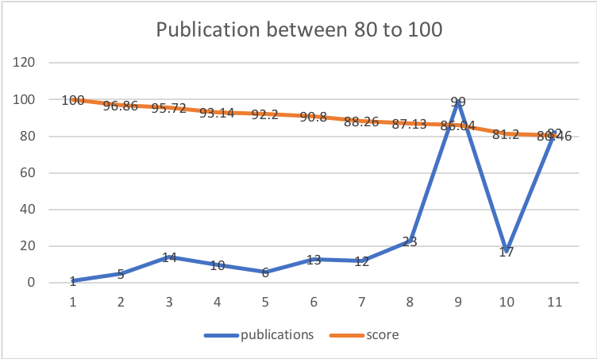
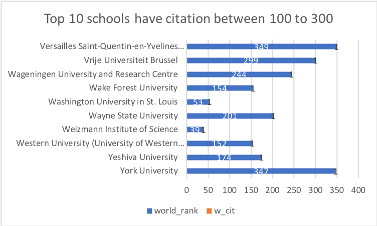
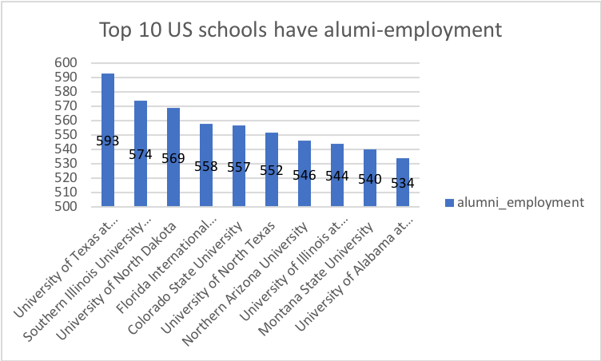
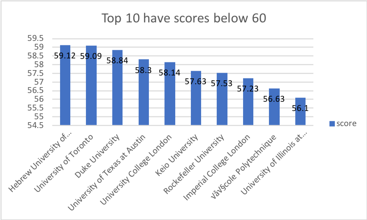
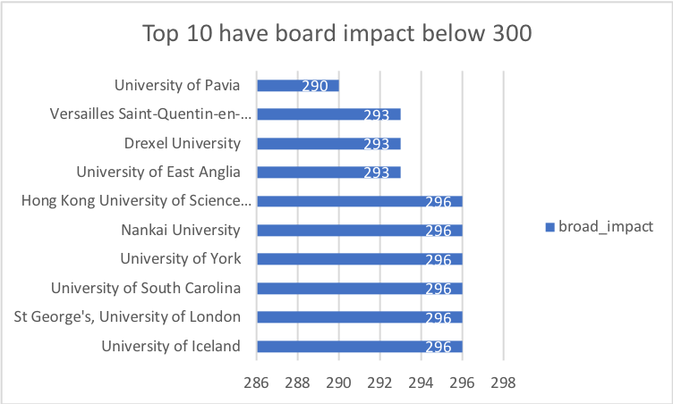
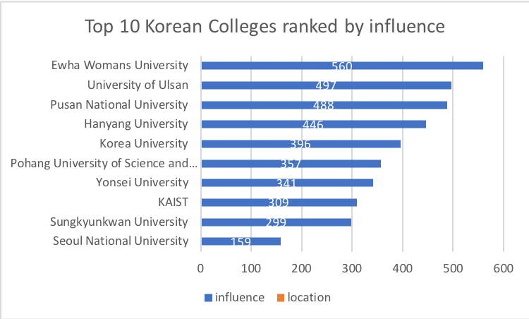
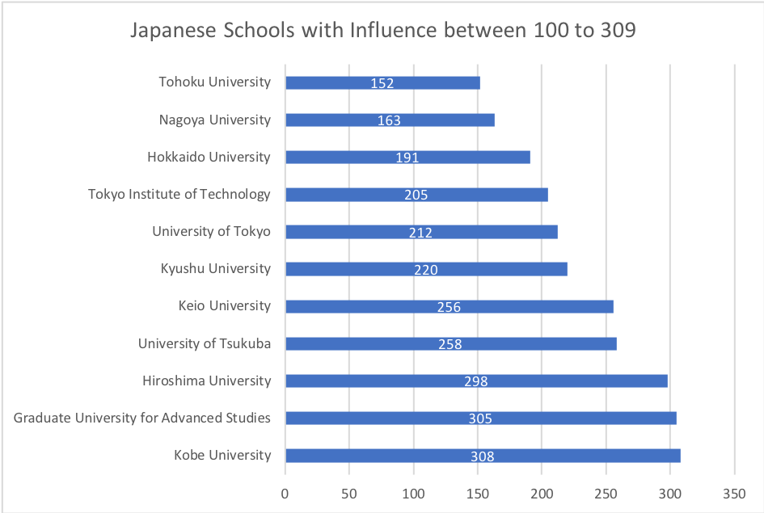
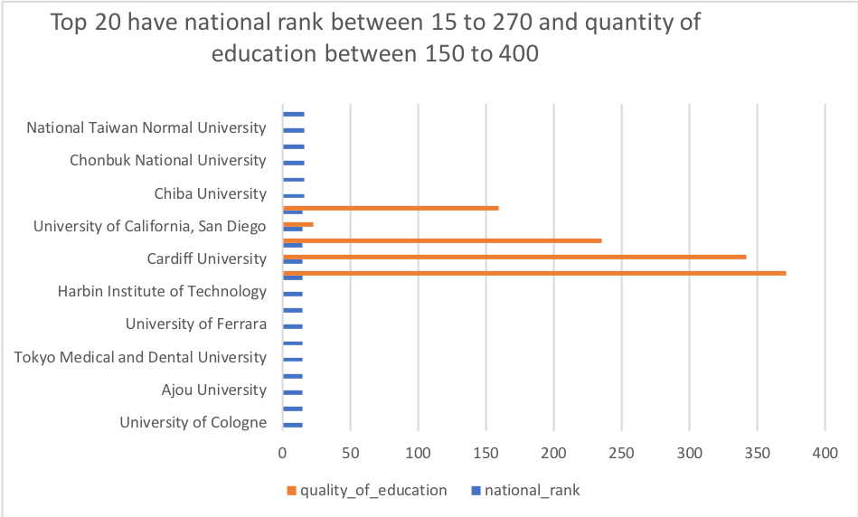

# Checkpoint3: World College Rankings

* Datasets: World college ranking
* These colleges are ranked by location, national rank, quality of education, alumni employee, quality of faculty, publications, influences, citations, board impact, and patents, then it calculate a final score for ranking. Every column are ranking except of the score.


* National Rank: basically order the final score for each colleges
* Quality of Education: it was calcualted from students' overall GPA from classes
* Alumni Employee: It focues on amount student who graduated from their old school and keep working there
* Quality of faculty: Based on teacher evaluation from students
* Publication: based on the sales volume from school's publication (book or research)
* influences: basically calcualte the amount of honorees and Distinguished Alumni
* Citation: It is just amount of citation
* Board Impact: influence created by the board of directors
* Patent: The number of patent they created 


Business Question: From this dataset, we can answer what colleges is the best in UK or some other countries, we can also find out the colleges have score below maybe 60 or 70. We are able to rank influences from highest to lowest. 

1. -- Rank the quality_of_education from the lowest to highest in the US

For Q1, we are ranking the world rank (USA) based on quality of education (Ranking, not score) from highest to lowest. Firstly, the dataset gave us world and quality of education. After coding, we have our top 10 colleges ordered by quality of education ASC, the lower number they have, the higher rank they've got. And then we have school with first place ranks first (Quality of education) in the world, and school with 3rd place ranks second for the quality of education. 

```SQL
SELECT world_rank,quality_of_education
FROM datasets.world_college_ranking
WHERE location = 'USA'
ORDER BY quality_of_education ASC
```




2. -- Rank the world rank from the highest to lowest in UK

For Q2, we want to have our world rank for British schools ranked from highest to lowest. From the dataset, we still have world rank and we also have institution grouped. While ordering the world rank, we still did ASC. And then we have Cambridge ranked the 4th place, Oxford ranked the 5th place and other 8 British schools' ranking in the graph. 

```SQL
SELECT world_rank, institution
FROM datasets.world_college_ranking
WHERE location = 'United Kingdom'
ORDER BY world_rank ASC
```




3. -- Rank the publications based on the score between 80 to 100

Firstly, the data provides us publication and then we have to select score between 80 to 100 based on the question we created. We basically rank the publication by ordering the final score between 80 to 100 then we have our final answer that the school with score of 100 is the first place, the school with score of 96.86 is the 5th place in the world. 

```SQL
SELECT publications, score
FROM datasets.world_college_ranking
WHERE score between '80' and '100'
ORDER BY score DESC
```




4. -- What schools have citation between 100 to 300

For Q4, We ranked schools based on their rank of citation between 100 to 300. The dataset provides citation as main data for this question, but they all have citation ranked in 278 after coding, so we count citations as w_cit to save some space, and then we have 1 showing on graph. 

```SQL
SELECT institution, world_rank,
    count(citations) as w_cit
FROM datasets.world_college_ranking
WHERE citations between '100' and '300'
GROUP BY institution, world_rank
ORDER BY institution DESC
```




5.-- In the US, what schools have alumi-employment between 270 to 600

We are trying to rank us schools based on theri alumi-employment between 270 to 600 but we only want to rank the top 10, so we only have our actual rank between 593 to 534, that means the schools on the graph do not have very good alumi-employment due to lower ranking offered by the dataset. This time, we did DESC because we must get the highest number first. The higher number they have, the lower rank they've gotten. 

```SQL
SELECT institution, location, alumni_employment
FROM datasets.world_college_ranking
Where location = 'USA' AND alumni_employment between '270' AND '600'
GROUP BY institution, location,alumni_employment
ORDER BY alumni_employment DESC
```




6. -- What schools have score below 60?

This time, we selected school have lower score below 60 that kindly means they are not that competitive with schools that have higher ranks. Firstly, we have score from the dataset, and then we code it and selece schools below 60 out. afterward, we can order them from the highest(59.13) to the lowest(56.1) based on the graph. 

```SQL
SELECT institution, score
FROM datasets.world_college_ranking
WHERE score <= '60'
ORDER BY score DESC
```




7. -- What schools have broad_impact below 300?

For Q7, we just want to select schools with broad impact rank below 300 that means they are on average. This time, we did not group at all, we just putted broad impact less and equal than 300 then we ordered them. Since we only do top 10, so basically the rank is between 296 to 290. 

```SQL
SELECT institution, broad_impact
FROM datasets.world_college_ranking
WHERE broad_impact <= '300'
ORDER BY broad_impact DESC
```




8. -- What is the rank of influence in South Korea

We want to know the influence rank in South Korea. From the dataset, we firstly have to find out our main location, which is Korea. Then we must order influence ASC. For the result, we have Seoul National Univ ranks 159 and Sungkyunkwan Univ ranks 299 for the influence. Basically, the top 10 schools on graph have the first 2 schools on average. 

```SQL
SELECT institution, influence, location
FROM datasets.world_college_ranking
WHERE location = 'South Korea'
ORDER BY influence ASC
```


9. -- What is the influence rank for Japan between 100 to 309

We tried to find out Japanese school with influence rank between 100 to 309, we still point out the location first then we selece the influence rank between 100 to 309 from the dataset. After coding, we will have Tohoku Univ ranks 152 and Nagoya Univ places 163 and other 8 schools.

```SQL
SELECT institution, location, influence
FROM datasets.world_college_ranking
WHERE location = 'Japan' and influence between '100' and '309' 
ORDER BY influence DESC
```




10. -- what colleges have national rank between 15 to 270 and quality of education between 150 to 400

The dataset gives us a huge amount of data and each ranking for the college. For the question, we are trying to find out any shcool with rank between 15 t0 270 and then we have code the quality of education from 150 to 400 out. Definitely, we use where function to code the data we want. Then we have the result, we have National Taiwan Normal Univ with national rank of 15 and quality of education rank of 383.

```SQL
SELECT institution, national_rank, quality_of_education
FROM datasets.world_college_ranking
WHERE national_rank between '15' and '270' AND quality_of_education between '150' and '400'
ORDER BY national_rank, quality_of_education DESC
```



